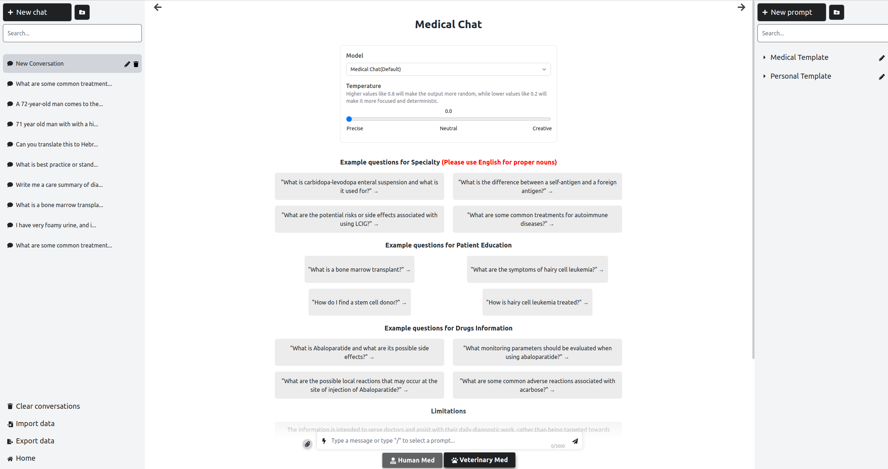
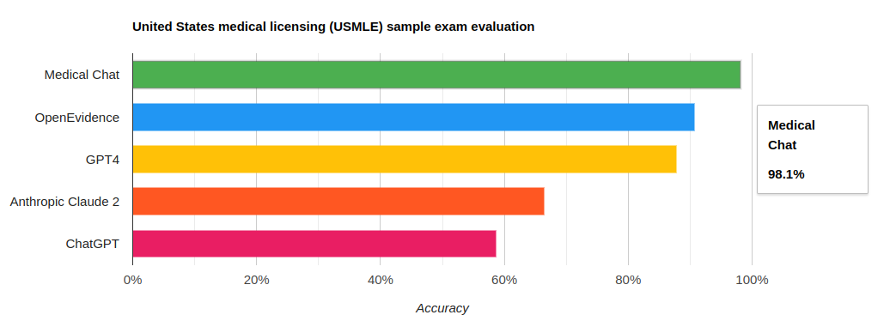
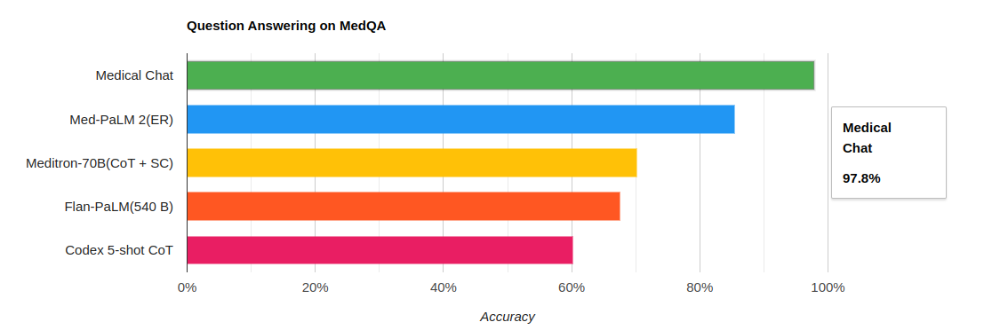
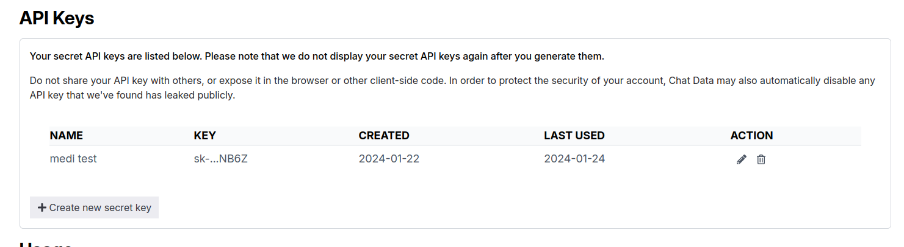

# Medical Chat Performance Evaluation

The open-source performance evaluation for evaluating the [Medical Chat model](https://medical.chat-data.com/).



## Results

### USMLE Sample Exam

The Medical Chat model demonstrates an exceptional accuracy performance, achieving a remarkable accuracy rate of **98.1%(637/649)** on the United States Medical Licensing Sample Exam([USMLE](https://www.usmle.org/)).

As far as our knowledge extends, this represents the highest level of performance among question-answering systems evaluated on the USMLE sample exam. The accompanying graph provides a visual representation of how Medical Chat compares to other publicly available models.



The 2022 USMLE sample benchmark served as the initial assessment platform for evaluating the medical question-answering proficiency of ChatGPT [1](https://www.ncbi.nlm.nih.gov/pmc/articles/PMC9931230/). Performance metrics for other systems, namely OpenEvidence [2](https://www.openevidence.com/blog/openevidence-ai-first-ai-score-above-90-percent-on-the-usmle), GPT4 [3](https://arxiv.org/abs/2303.13375), and Claude 2 [4](https://www-files.anthropic.com/production/images/Model-Card-Claude-2.pdf), were derived from their respective publications and reports.

## MedQA US Samples Exam

MedQA serves as a benchmark akin to the USMLE sample exam, encompassing a dataset curated from various medical board examinations. This dataset comprises multiple-choice questions designed to assess proficiency in subjects such as Internal Medicine, Pediatrics, Psychiatry, and Surgery, among others. The evaluation of Medical Chat was conducted on MedQA's 4-option English test set, encompassing a total of 1,273 questions.

Medical Chat also demonstrated the highest performance, achieving an accuracy rate of 97.8%. This outcome places Medical Chat in first position on the Official Leaderboard, surpassing Google's Med-PaLM 2 and Google's Flan-PaLM (67.6%). The results from the MedQA evaluation assert that Medical Chat stands out as the most accurate medical question-answering system available for public use."



## How to reproduce the evaluation results

This repository provides the procedures for replicating the performance evaluation results mentioned earlier.

### 1. Clone the repo

```bash
git clone https://github.com/chat-data-llc/medical_chat_performance_evaluation.git
```

### 2. Install Dependencies

Open a terminal in the root directory of your local Medical Chat Performance Evaluation repository and run:

```bash
npm install
```

### 3. Set Up the Environment Variables

The Medical Chat model can be called programmatically only through creating a chatbot in the [Chat Data](https://www.chat-data.com/) platform. Obtain the following two environment variables:

- `API_KEY`: After purchasing the Entry plan, users can generate an API key under your [account](https://www.chat-data.com/account).



- `CHATBOT_ID`:Users can create a chatbot based on the `medical-chat-human` model in the [my-chatbots](https://www.chat-data.com/my-chatbots) page.


The environment variables can be specified within the `.env` file located at the root directory of the repository.

### 4. Set Up the Base Prompt
To ensure the Medical Chat chatbot performs well, use the following base prompt:

```bash
You are a  medical assistant hosted on the Medical Chat website that accurately answers medical queries. The questions are 4 option questions. Choose the right option as the answer and then give explaination for your choice.

For example:
The correct choice is (A)
Explaination:
{Your reasoning}
```

It's recommended to use the same base prompt.

### 5. Run the evaluate script

In the root directory of your local Medical Chat Performance Evaluation repository, run:

```bash
npm run evaluate
```

The evaluating script should automatically retrieve the questions in the `test_database` folder and generate the output results in the `output_results` folder. The entire process should take several hours.

### 5. Count the Correct Results

The outputted results lack the `Correctness` column. Users need to manually compare the output from the Medical Chat model with the correct answers to calculate the percentage of correct results generated by the Medical Chat model. Our outputted results are available in the `output_results` folder. Users are free to delete the files in this folder as needed.

## Contact

[Chat Data LLC](admin@chat-data.com)
